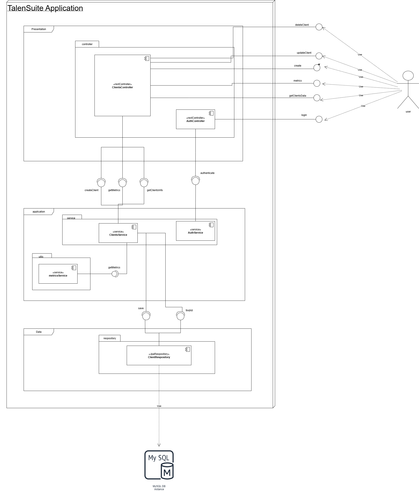

# 🧾 ClientSuite - Customer Management Microservice

ClientSuite is a microservice developed for a company aiming to enhance customer experience through efficient client data registration, retrieval, and analysis. The service is built using **Spring Boot**, **MySQL**, and **Redis**, and supports modern DevOps practices like **Docker**, **Terraform**, and **AWS deployment**.

---

## 🧩 Architecture Overview

This service follows a layered architecture (to be refactored to Hexagonal in v2.0), leveraging:

- **Spring Boot (MVC)** for API exposure
- **Spring Data JPA** for persistence
- **Redis** for caching query results
- **Flyway** for database versioning
- **Docker** for containerization
- **Terraform** for infrastructure provisioning
- **EC2** as deployment target
- **GitFlow** as the branching strategy

📌 **A diagram of the system components is available below**:



---

## 🚀 Features

- ✅ Create, retrieve, and analyze client data
- ⚡ Efficient query performance using Redis Cache
- ♻️ Cache invalidation on resource changes
- 📚 Database schema migrations via Flyway
- 📊 Exposed metrics and health endpoints
- 🔒 Prepared for scalable deployments

---

## 📦 Tech Stack

| Layer            | Technology           |
|------------------|----------------------|
| API              | Spring Boot (MVC)    |
| Persistence      | Spring Data JPA      |
| DB               | MySQL                |
| Caching          | Redis                |
| Migrations       | Flyway               |
| Containerization | Docker               |
| Infra as Code    | Terraform            |
| Deployment       | AWS EC2              |

---

## 🔗 API Access

### 🔍 Swagger UI  
Access the documentation of all endpoints:

```
http://3.91.236.73:8080/api/v1/clientSuite/swagger-ui
```

---

### 💓 Health Check  
Monitor the service status via Actuator:

```
http://3.91.236.73:8080/api/v1/clientSuite/actuator/healt
````

---

### 📬 Postman Collection  and bruno collection 🐶
A ready-to-use Postman and Bruno collections are available to test all the endpoints.  
- [collections](postman)

---

## 📂 Redis Cache Strategy

- Used to cache `GET` requests for client and statistics endpoints.
- TTL (Time to Live): 60 seconds for all entries.
- Invalidation on new user creation or when statistics need to be refreshed.
- Configured using Spring Cache abstraction and backed by Redis.

---

## ⚙️ Infrastructure & Deployment

### 🏗️ Infrastructure as Code

All infrastructure is provisioned using **Terraform**, including:

- VPC
- EC2 Instance
- Security Groups
- S3 (if required)
- Redis (Elasticache or Docker)

> Configuration files are located in the `infra/terraform` directory.

### 🚢 Docker & Deployment

- Docker images are built using:

```bash
docker build -t client-suite-app .
````

* Containers are defined in `docker-compose.yml`, including:

    * MySQL
    * Redis
    * client-suite-app

### 📜 Deployment Script

Inside the `infra` directory, there's a script that automates the deployment of the service to the EC2 instance.

> 📁 `infra/deploy-to-ec2.sh`

This script handles SSH connection, stops old containers, pulls updated images, and starts the application.

---

## 🔀 GitFlow Strategy

We used **GitFlow** as the branching strategy to manage releases and feature development effectively:

* `main`: Production-ready code
* `develop`: Development integration branch
* `feature/*`: New feature branches
* `release/*`: Pre-release branches
* `hotfix/*`: Production fixes

---

## 📈 Planned Changes for v2.0

* 🧱 Refactor architecture from **Layered Architecture** to **Hexagonal (Ports and Adapters)** for improved modularity and testability
* 🌐 Integrate distributed tracing using OpenTelemetry
* 📊 Add Prometheus and Grafana for monitoring
* 🧪 Implement full integration tests using Testcontainers
* ⚙️ Move deployment from EC2 to Kubernetes (AWS EKS)
* 💾 Implement data archival for old client records
* 📦 Set up automated CI/CD with GitHub Actions or Jenkins
* 📁 Externalize configurations with Spring Cloud Config Server

---

## 🏁 Get Started locally

1. Clone the repository
2. Configure your `.env` or `application.yml`
3. Run:

```bash
docker-compose up --build
```

4. Explore via Swagger!


```
http://localhost:8080/api/v1/clientSuite/swagger-ui
```

## 🧠 Author

Developed by: Johan RIcardo

*Java Developer  | Passionate about scalable architectures and clean code.*
